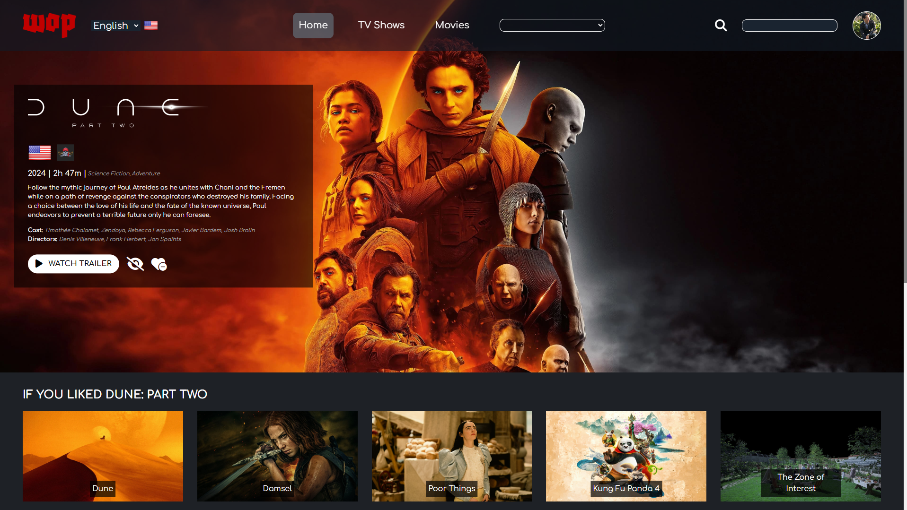

# Watch or Pass (WOP)

## Screenshots




## Project Description

Have you ever regret going to the Cinema after watching a terrible movie? Have you ever spent a "movie night" with friends, and the decision about what to watch was longer than the movie itself?
Watch or Pass (Wop) is a browser web app made with Vue JS, who uses the powerful TMDB api to provide you with all the relevant information about almost any existing movie or tv show, such us, but not only:

- **Movie rating**
- **Official trailer**
- **Plot summary and cast\directors information**
- **Available streaming providers**

The app will also recommend you new movies and tv shows based on what's most popular at the moment, or based on your research history and personal preferences (Watchlist and liked list).

## How to use

### Use Online

You can access the online  website by visiting the deploy link over Netlify: [Watch Or Pass](https://watch-or-pass.netlify.app/).

### Use Locally

To use the app locally, follow these steps:

1. **Clone the Repository**: Clone the project repository from GitHub to your local machine. Open your terminal and run the following command:

  ```bash
git clone https://github.com/AlessandroCampo/vite-boolflix.git
```


2. **Navigate to the Project Directory**: Change your current directory to the cloned project directory:

```bash
npm install
```

3. **Open the app**: Once the dependencies are installed, you open the page by running:
```bash
npm run dev
```
then open your web browser and navigate to the suggested localhost

### How to access  your personal page

While working on make it easier to spot in future updates, at the moment you can access your personal page (Where you can see your watchlist, favlist and your personal recomendations) by clicking on the avatar in the top right corner. By left clicking instead, you can upload your own profile picture.

## Future improvements

Since I'm still still working on this project, I would really appreciate any feedback and ideas for future improvements. As for now, this is what I'm planning to add next: 

- **Mobile Device Support**, by adding responsive layout and deploying a mobile app version trough Ionic
- **Improving loading logic**, as for now, I think loading timers are not handled great, causing unstable layout during those
- **More user personalization**, I will add more features to make the page look more personal to each individual user

Thanks for reading and trying out my project!


